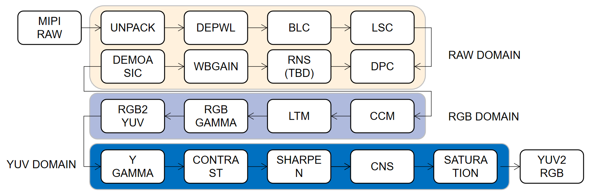

# Image Signal Process For HDR CMOS Image Sensor

# 项目描述


**一个使用C++编写的、用于HDR相机的ISP Pipeline**

- ISP模块使用C风格编写
- 没有其他库依赖
- 可以在任意嵌入式平台上部署
- 可以自定义你的pipeline通过json配置

# 默认Pipeline



# 支持的ISP模块列表

- Raw Domain
    - [x] MipiUnPack: mipi raw data unpack to raw16
    - [x] DePwl: decode the pwl curve
    - [ ] Dpc: dynamic pixel correct
    - [ ] Lsc: lens shding correct
    - [x] Blc: black level correct
    - [ ] Rns: raw noise filter
    - [x] WbGain: white balance gain
    - [x] Demoasic: change raw to rgb
- RGB Domain
    - [x] Ltm: local tone mapping
    - [x] RgbGamma: rgb gamma curve
    - [x] Ccm: color correct matrix
    - [x] Rgb2Yuv: rgb domain to yuv domain
- YUV Domain
    - [x] YGamma: gray gamma curve
    - [x] Contrast: gray contrast adjust
    - [x] Sharpen: gray usm sharpen
    - [ ] Cns: chrome noise filter
    - [x] Saturation: chrome saturation
    - [x] Yuv2Rgb: yuv domain to rgb domain

# 如何编译与运行

## Linux系统
**开发环境:** 
```bash
#dependencies install(cmake and opencv)
sudo apt update
sudo apt install cmake
```

**编译**

```bash
git clone https://github.com/JokerEyeAdas/HDRImageSignalProcess
cd HDRImageSignalProcess/
mkdir build
cmake ..
make -j12
```
## Windows系统

**开发环境(x64):** 
- vs code
- cmake
- vs2019 c++ gen tool

 

**编译**

```bash
git clone https://github.com/JokerEyeAdas/HDRImageSignalProcess
code HDRImageSignalProcess
#cmake 选择 Debug or Release
#compiler 选择 xxx-amd64
#build all
```

## 运行

```bash
cd build
#cp cfgs and data
cp -r ../data/ ./
cp -r ../cfgs/ ./
#run isp
./HDR_ISP ./cfgs/isp_config_cannon.json
```
## 如何调试参数

**通过修改json配置来配置ISP模块的基本参数**

如，修改sensor基本参数：
```json
    "raw_file": "./data/connan_raw14.raw",
    "out_file_path": "./",
    "info": {
        "sensor_name": "cannon",
        "cfa": "RGGB",
        "data_type": "RAW16",
        "bpp": 16,
        "max_bit": 14,
        "width": 6080,
        "height": 4044,
        "mipi_packed": 0
    },
```

修改rgb gamma参数如下：

```json
"rgbgamma": {
        "enable": true,
        "in_bit": 10,
        "out_bit": 8,
        "gammalut_nums": 11,
        "gammalut": [
            0,
            0.3504950718773984,
            0.48243595264750255,
            0.57750428843709,
            0.6596458942714417,
            0.731034378464739,
            0.7925580792857235,
            0.8509817015104557,
            0.9029435754464383,
            0.9534255851019492,
            1.0
        ]
    }
```

# 结果

## Pipeline运行结果

|备注|图像|
|-------|-------|
|Raw||
|ISP Result(Ours)||
|FastOpenISP Result||

------

## 细节对比

|ISP|图像1|图像2|备注|
|-------|-------|--------|-------|
|Ours|||细节与边界明显保留|
|Fast Open Isp|||细节丢失以及Color banding|

# 后续工作

* 支持Dpc、Rns、Cns等ISP模块;
* GUI ISP调试工具编写。

# 项目支持

- 感谢您的支持，希望我的项目对您有帮助


# 参考仓库

感谢下述仓库以及仓库作者！！

|序号|仓库|开发语言|备注|
|-----|-----|-----|-----|
|0|[OpenISP](https://github.com/cruxopen/openISP)|Python|image signal process in C style|
|1|[fast-openIsp](https://github.com/QiuJueqin/fast-openISP)|Python|open isp 快速版本|
|2|[ISP Lab](https://github.com/yuqing-liu-dut/ISPLab)|C++|C++版本开源ISP|
|3|[xk-ISP](https://github.com/openasic-org/xkISP)|C++|复旦大学开源HLS ISP|


# 关注我


**知乎主页：[ADAS之眼](https://www.zhihu.com/people/fen-shi-qing-nian-29) | 个人网站：[ADAS之眼](https://jokereyeadas.github.io/) | 公众号：**

****


**ADAS之眼权利保留@2023，未经允许，禁止商业用途**

-----