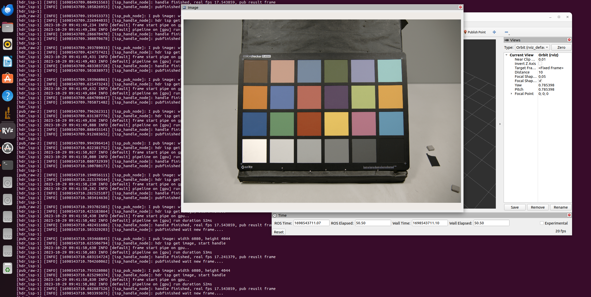

# Image Signal Process For HDR CMOS Image Sensor

**[CH](docs/readme_ch.md) | [EN](./readme.md)**


# Project Description


**An ISP pipeline written in C++ for HDR cameras**

- The ISP modules are written in C style
- Without other library dependencies
- ~~Can be deployed various embedded platforms~~
- Customize your pipeline through json configuration
- Can be deployd on the devices with GPU which supports cuda, such as PC、Nvidia Jeston Orin and so on
- The ISP support ROS2 which can handle raw image by topic
- Supports running on CPU and GPU, which GPU only provides libs that has build for evaluation (Please join Knowledge Planet to obtain the GPU source code)


# Default Pipeline


# Support ISP Module Lists(CPU and GPU)

- Raw Domain
    - [x] MipiUnPack: mipi raw data unpack to raw16
    - [x] DePwl: decode the pwl curve
    - [x] Dpc: dynamic pixel correct
    - [x] Lsc: lens shding correct
    - [x] Blc: black level correct
    - [ ] Rns: raw noise filter
    - [x] WbGain: white balance gain
    - [x] Demoasic: change raw to rgb
- RGB Domain
    - [x] Ltm: local tone mapping
    - [x] RgbGamma: rgb gamma curve
    - [x] Ccm: color correct matrix
    - [x] Rgb2Yuv: rgb domain to yuv domain
- YUV Domain
    - [x] YGamma: gray gamma curve
    - [x] Contrast: gray contrast adjust
    - [x] Sharpen: gray usm sharpen
    - [x] Cns: chrome noise filter
    - [x] Saturation: chrome saturation
    - [x] Yuv2Rgb: yuv domain to rgb domain

# How To Build and Run

## Linux
**Develop Env :** 
* nvcc
* cmake
* g++

**Build**

- **No ROS2**
```bash
git clone https://github.com/JokerEyeAdas/HDR-ISP
cd HDR-ISP/
git checkout gpu_dev
mkdir build
cmake ..
make -j12
```
- **ROS2 build**
1. clone repo
```bash
git clone https://github.com/JokerEyeAdas/HDR-ISP
cd HDR-ISP/
git checkout gpu_dev
```

2. edit CMakeLists.txt to set the ROS2_ENABLE to true
```CMakeLists.txt
set(ROS2_ENABLE true)
```

3. build it

```bash
cd ${ros2_wk}
colcon build
```

## Windows

**Develop Env (x64):** 
- vs code
- cmake
- nvcc
- vs2019 c++ gen tool

 

**Build**

- **No ROS2**

```bash
git clone https://github.com/JokerEyeAdas/HDR-ISP
code HDR-ISP
git checkout gpu_dev
#cmake choose Debug or Release
#compiler choose xxx-amd64
#build all
```

- **With ROS2**

1. clone repo
```bash
git clone https://github.com/JokerEyeAdas/HDR-ISP
cd HDR-ISP/
git checkout gpu_dev
```
2. edit CMakeLists.txt to set the ROS2_ENABLE to true
```CMakeLists.txt
set(ROS2_ENABLE true)
```
3. build it

```bash
cd ${ros2_wk}
colcon build --merge-install
```

## How To Run

```bash
cd build
#cp cfgs and data
cp -r ../data/ ./
cp -r ../cfgs/ ./
#run isp
./hdr_isp ./cfgs/isp_config_cannon.json
```

## How To Change Run Device and Mode

- Run on GPU

change device by edit json:
```json
    "device":"gpu",
```

- Run on CPU

change cpu device by edit json:
```json
    "device":"cpu",
```
- Run online mode by handle img topic
```json
    "mode":"online",
    "topic":"/raw/connan",
```

- Run offline mode by handle raw img
```json
    "mode":"offline",
    "raw_file": "./data/connan_raw14.raw",
    "out_file_path": "./",
```


## How To Tunning Params

**By changing Json Config**

example1, change sensor params:
```json
    "info": {
        "sensor_name": "cannon",
        "cfa": "RGGB",
        "data_type": "RAW16",
        "bpp": 16,
        "max_bit": 14,
        "width": 6080,
        "height": 4044,
        "mipi_packed": 0
    },
```
example2, change rgb gamma params:
```json
"rgbgamma": {
        "enable": true,
        "in_bit": 10,
        "out_bit": 8,
        "gammalut_nums": 11,
        "gammalut": [
            0,
            0.3504950718773984,
            0.48243595264750255,
            0.57750428843709,
            0.6596458942714417,
            0.731034378464739,
            0.7925580792857235,
            0.8509817015104557,
            0.9029435754464383,
            0.9534255851019492,
            1.0
        ]
    }
```

# Result

## ISP Result

|Notes|Image|
|-------|-------|
|Raw||
|ISP Result(Ours)||
|FastOpenISP Result||

------

## Detail Compare

|ISP|Image1|Image2|Notes|
|-------|-------|-------|--------|
|Ours|||Detail and boundaries is clear|
|Fast Open Isp|||Color banding and detail lost|

## Run On Ros and GPU Performance

- Performance(Without ISP result image publish)

|Index|Resolution|Fps|
|----|-----|----|
|1|6080*4044|15|
|2|3840*2160|40|
|3|1920*1080|125|

- ROS2 Online mode
  



# Follow-Up

## TBD
* Write ISP tunning GUI tools or Python tools.

## Join us
- If you want work together and learn the source code and module information，please join us!!!
  

- Join us:


## Project Support

- Thanks for your support, we hope that my project can help your work


# Reference Repo

Thanks for the following code repository!

|Index|Repo|Language|Notes|
|-----|-----|------|-----|
|0|[OpenISP](https://github.com/cruxopen/openISP)|Python|image signal process in C style|
|1|[fast-openIsp](https://github.com/QiuJueqin/fast-openISP)|Python|open isp speed up verison in python|
|2|[ISP Lab](https://github.com/yuqing-liu-dut/ISPLab)|C++|Isp realized by c++|
|3|[xk-ISP](https://github.com/openasic-org/xkISP)|C++|C++ ISP For HLS on FPGA|


# Follow Me

**Zhihu：[EYES OF ADAS](https://www.zhihu.com/people/fen-shi-qing-nian-29) | Blog：[EYES OF ADAS](https://jokereyeadas.github.io/) | WeChat：**

****


**Copyright [2023] [Eyes of ADAS]**

**Eyes of Adas All Right Reserved, No Commercial Use Without Permission**

-----
